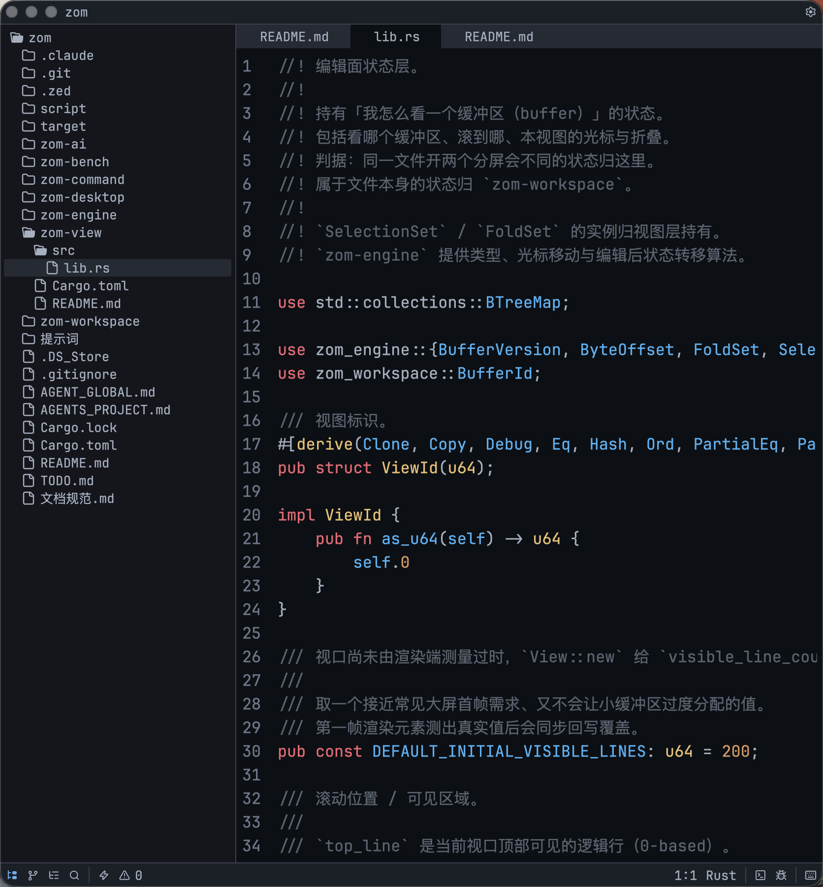

# zom

> 一个用 Rust 写的现代桌面文本编辑器。引擎纯净、命令统一、可无头测试。



[特性](#特性) · [安装](#安装) · [快速上手](#快速上手) · [架构](#架构) · [路线图](#路线图) · [贡献](#贡献)

---

## 特性

- ⚡ **原生性能** —— Rust + GPU 加速的 GPUI 渲染，启动毫秒级、滚动零卡顿。
- ✍️ **现代编辑体验** —— 多光标、IME、折叠、滚动平滑、跨平台键位一致。
- 🌳 **Tree-sitter 语法高亮** —— 内置 Rust / TOML / Markdown / JSON / YAML / Bash / HTML / CSS / JavaScript / TypeScript / Java / Python。
- 🎯 **一切皆命令** —— 键盘、命令面板、菜单、AI 都通过同一条派发路径；宏即「录命令队列」，AI agent 即「灌命令队列」。
- ⌨️ **可编排键位** —— 多段 leader key、前缀 trie、`when` 谓词，向 Emacs / Vim / VS Code 看齐。
- 🤖 **AI 协议一等公民** —— 内置 chat / 工具调用 / 流式抽象，与具体厂商解耦，可接任意 provider。
- 🔬 **可无头测试的内核** —— 编辑引擎、视口数学、命令派发全部能脱离 GUI 单独测，回归不靠人眼。

## 截图


> 更多截图见 [`docs/screenshots/`](docs/screenshots/)。

## 安装

### 预编译版本

正在发布中，请关注 [Releases](../../releases) 页面。

### 从源码构建

需要 [Rust 工具链](https://rustup.rs)（edition 2024）。

```bash
git clone <repo-url> zom
cd zom
cargo run -p zom-desktop --release
```

### 平台支持

| 平台    | 状态        |
| ------- | ----------- |
| macOS   | ✅ 已支持   |
| Windows | ✅ 已支持   |
| Linux   | ⏳ 暂未支持 |

## 快速上手

启动后先进入项目选择器，选一个目录即进入编辑工作区。下面是当前已实装的默认快捷键（macOS 用 `⌘`，Windows 用 `Ctrl`，下表统一记作 `Mod`）：

**项目与面板**

| 快捷键        | 操作            |
| ------------- | --------------- |
| `Mod+O`       | 打开项目选择器  |
| `Mod+Shift+E` | 切换文件树面板  |
| `Mod+Shift+F` | 项目内搜索      |
| `Mod+,`       | 打开设置        |
| `Mod+Shift+K` | 查看全部快捷键  |

**编辑**

| 快捷键              | 操作                |
| ------------------- | ------------------- |
| `Mod+S`             | 保存当前文件        |
| `Mod+W`             | 关闭当前标签        |
| `Mod+L` / `Mod+H`   | 切到下一个 / 上一个标签 |
| `Mod+Z` / `Mod+Shift+Z` | 撤销 / 重做     |
| `Mod+A`             | 全选                |
| `Mod+C` / `Mod+X` / `Mod+V` | 复制 / 剪切 / 粘贴 |
| `Mod+F`             | 当前文件查找        |

**窗口**

| 快捷键          | 操作       |
| --------------- | ---------- |
| `Mod+Q`         | 退出       |
| `Mod+M`         | 最小化窗口 |
| `Mod+Shift+M`   | 最大化窗口 |

更多命令与默认绑定见 [`zom-command`](zom-command/README.md)。键位完全由 `Keymap` 注册，后续会开放用户自定义。

## 架构

`zom` 是一个 Cargo workspace，按职责拆成 6 个互为黑盒的 crate：

```text
zom-desktop  ─┐
              ├─ 组合根：GPUI 外壳、输入解码、wiring
              │
zom-command  ─┤  命令派发脊柱 + 键位模型
zom-workspace┤  缓冲区与文件生命周期
zom-view     ─┤  视图状态：滚动、selection、fold
zom-ai       ─┤  AI 协议层（消息 / 工具 / 流式）
              │
zom-engine   ─┘  纯文本编辑引擎底座
```

**核心设计**：

- 每个 crate 只通过 public API 连接，跨 crate 不依赖私有实现。
- `zom-engine` 不知道 UI、命令、AI 的存在，因此可独立演进并被复用。
- 「同一文件开两个分屏会不同的状态」归 `zom-view`，「不会不同的状态」归 `zom-workspace`。
- 历史不归命令执行器 —— `editor.undo` 只是一条命令，真实事务由引擎记录。

各 crate 边界详见其 README：[engine](zom-engine/README.md) · [workspace](zom-workspace/README.md) · [view](zom-view/README.md) · [command](zom-command/README.md) · [ai](zom-ai/README.md) · [desktop](zom-desktop/README.md)。

## 路线图

以 `zom-engine` 的能力域为主轴，逐步把能力稳定接入宿主层与桌面外壳。详见 [`TODO.md`](TODO.md)。

近期重点：

- 宿主层 public API 形状打磨。
- 桌面外壳的面板、设置、语言服务入口落地。
- 第一个 release 渠道。

## 开发

```bash
# 构建整个 workspace
cargo build --workspace

# 跑全部测试
cargo test --workspace

# 格式化
cargo fmt

# 启动桌面端（debug）
cargo run -p zom-desktop
```

协作约定与代码风格见 [`AGENT_GLOBAL.md`](AGENT_GLOBAL.md)；项目结构和测试策略见 [`AGENTS_PROJECT.md`](AGENTS_PROJECT.md)。

## 贡献

欢迎 issue 与 PR。提交前请：

1. 阅读 [`AGENT_GLOBAL.md`](AGENT_GLOBAL.md) 与 [`AGENTS_PROJECT.md`](AGENTS_PROJECT.md)。
2. 运行 `cargo fmt` 与 `cargo test --workspace`。
3. 新增 public API 时同步说明长期语义、调用方影响与测试覆盖。
