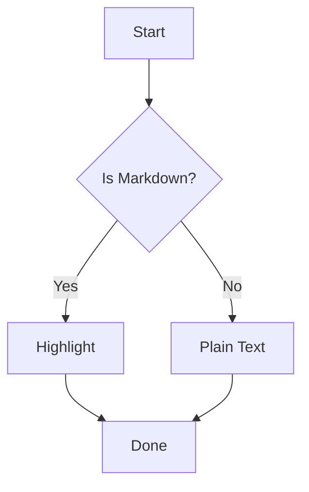
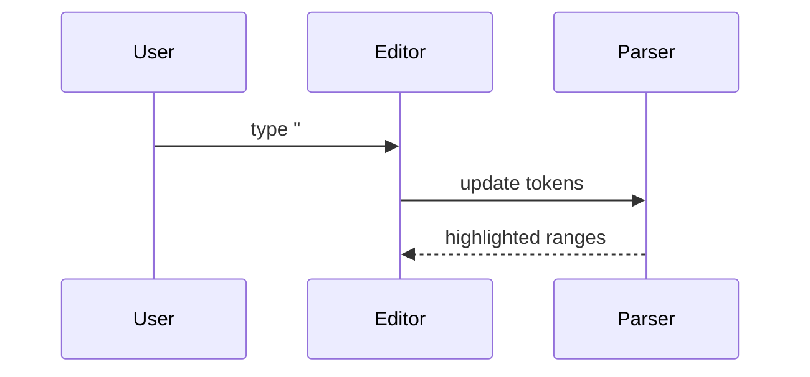

# Markdown 语法高亮测试文件

这是一个用于测试 **Markdown 语法高亮** 的综合样例文件。  
它包含常见语法、扩展语法、嵌套结构、边界情况，以及一些容易影响解析器状态的内容。

---

## 1. 标题

# H1 一级标题
## H2 二级标题
### H3 三级标题
#### H4 四级标题
##### H5 五级标题
###### H6 六级标题

Setext Heading 1
================

Setext Heading 2
----------------

### 标题中包含 `inline code`、**加粗**、*斜体* 和 [链接](https://example.com)

---

## 2. 段落与换行

这是第一段文本。Markdown 中的普通段落通常由空行分隔。

这是第二段文本，包含中文、English、数字 123、emoji 😀、全角标点，以及特殊字符：  
`~!@#$%^&*()_+-={}[]|\:;"'<>,.?/`

这一行末尾有两个空格，会触发硬换行。  
这一行是硬换行后的内容。

这一行使用反斜杠触发硬换行。\
这一行是反斜杠硬换行后的内容。

---

## 3. 强调、加粗、删除线、高亮

*斜体文本*  
_斜体文本_  
**加粗文本**  
__加粗文本__  
***加粗斜体文本***  
___加粗斜体文本___  
~~删除线文本~~  
==高亮文本（部分 Markdown 扩展支持）==

边界测试：

abc*不是斜体?*def  
abc_不是斜体?_def  
**bold _nested italic_ bold**  
*italic **nested bold** italic*  
~~delete **bold inside delete** delete~~

---

## 4. 行内代码

这是 `inline code`。

行内代码包含反引号：`` const s = `template`; ``

行内代码中的 Markdown 不应被解析：`**not bold** [not link](x) # not heading`

中文上下文：这里是 `代码片段` 后面的中文。

---

## 5. 代码块

### 5.1 缩进代码块

    fn main() {
        println!("Indented code block");
    }

### 5.2 围栏代码块：无语言

```
plain fenced code block
# this is not a heading
**this is not bold**
```

### 5.3 Rust

```rust
use std::ops::Range;

#[derive(Debug, Clone)]
struct Token<'a> {
    kind: TokenKind,
    text: &'a str,
    span: Range<usize>,
}

#[derive(Debug, Clone, PartialEq, Eq)]
enum TokenKind {
    Heading,
    Emphasis,
    Code,
    Link,
}

fn is_char_boundary(s: &str, idx: usize) -> bool {
    s.is_char_boundary(idx)
}

fn main() {
    let text = "写法风格";
    for (i, ch) in text.char_indices() {
        println!("{i}: {ch}");
    }
}
```

### 5.4 JavaScript / TypeScript

```ts
type MarkdownToken =
  | { type: "heading"; level: number; text: string }
  | { type: "code"; lang?: string; value: string }
  | { type: "text"; value: string };

const regex = /^(#{1,6})\s+(.*)$/u;

export function parseHeading(line: string): MarkdownToken | null {
  const match = line.match(regex);
  if (!match) return null;

  return {
    type: "heading",
    level: match[1].length,
    text: match[2],
  };
}
```

### 5.5 Python

```python
from dataclasses import dataclass
from typing import Literal

@dataclass
class Token:
    kind: Literal["heading", "emphasis", "code"]
    text: str
    start: int
    end: int

def tokenize(text: str) -> list[Token]:
    return [
        Token("heading", line, 0, len(line))
        for line in text.splitlines()
        if line.startswith("#")
    ]
```

### 5.6 JSON

```json
{
  "name": "markdown-highlighter-test",
  "version": "1.0.0",
  "features": [
    "headings",
    "lists",
    "tables",
    "code_fences",
    "frontmatter"
  ],
  "unicode": "中文 😀 é ñ"
}
```

### 5.7 Shell

```bash
#!/usr/bin/env bash
set -euo pipefail

grep -nE '^(#{1,6})\s+' test.md
printf '%s\n' "Hello Markdown"
```

### 5.8 SQL

```sql
SELECT id, title, created_at
FROM documents
WHERE body LIKE '%markdown%'
ORDER BY created_at DESC
LIMIT 10;
```

### 5.9 HTML

```html
<section class="markdown-preview">
  <h1 data-level="1">Title</h1>
  <p>Hello <strong>Markdown</strong></p>
</section>
```

### 5.10 未闭合代码块测试

下面这段故意放在引用中，避免破坏整个文件：

> ```js
> console.log("unclosed fence inside blockquote");
> const x = 1;
> ```

---

## 6. 引用块

> 这是一级引用。
>
> > 这是二级嵌套引用。
> >
> > - 引用中的列表项
> > - 第二项包含 `inline code`
>
> 引用中包含 **加粗**、*斜体* 和 [链接](https://example.com)。

> #### 引用中的标题
>
> ```rust
> fn quoted_code() {
>     println!("code inside blockquote");
> }
> ```

---

## 7. 列表

### 7.1 无序列表

- item one
- item two
  - nested item two.one
  - nested item two.two
    - deeply nested item
- item three

* asterisk item
* another item

+ plus item
+ another plus item

### 7.2 有序列表

1. first
2. second
   1. nested first
   2. nested second
3. third

99. ordered item starting at 99
100. next item

### 7.3 混合列表

1. 有序列表项
   - 无序子项
   - 无序子项中包含：
     ```js
     const insideList = true;
     ```
2. 第二项
   > 列表中的引用块
   >
   > - 引用块里的列表

### 7.4 任务列表

- [x] completed task
- [ ] incomplete task
- [X] uppercase X task
- [ ] task with **bold**
- [ ] task with `code`

---

## 8. 链接

普通链接：[Example](https://example.com)

带标题链接：[Example with title](https://example.com "Example Title")

自动链接：<https://example.com>

邮箱自动链接：<user@example.com>

引用链接：[OpenAI][openai]

重复引用链接：[OpenAI again][openai]

未定义引用链接：[missing-ref][does-not-exist]

[openai]: https://openai.com "OpenAI"

URL 中带括号：[link](https://example.com/path_(with_parentheses))

转义链接字符：\[not a link\](https://example.com)

---

## 9. 图片


引用图片：

![OpenAI Logo][logo]

[logo]: https://example.com/logo.png "Logo Title"

图片嵌套链接：

[](https://example.com)

---

## 10. 表格

| Name | Type | Description |
| --- | --- | --- |
| `heading` | block | 标题 |
| `emphasis` | inline | *斜体* 或 **加粗** |
| `code_fence` | block | ``` fenced code ``` |
| `link` | inline | [链接](https://example.com) |

对齐表格：

| Left | Center | Right |
| :--- | :----: | ----: |
| a | b | c |
| long text | `code` | **bold** |
| 中文 | 😀 | 123.45 |

边界表格：

| escaped pipe | normal |
| --- | --- |
| a \| b | c |
| `a | b` | inside code pipe |

---

## 11. 分隔线

---

***

___

- - -

* * *

_ _ _

---

## 12. 转义字符

\*not italic\*  
\# not heading  
\[not link\](https://example.com)  
\`not code\`  
\\ backslash

---

## 13. HTML 块与行内 HTML

<div class="note">
  <p>这是一个 HTML 块。</p>
  <strong>HTML bold</strong>
</div>

Markdown 中的 <span class="inline">inline HTML</span> 示例。

<!-- 这是 HTML 注释，测试注释高亮 -->

<script>
const unsafe = "<strong>html inside script</strong>";
console.log(unsafe);
</script>

<style>
.markdown-preview {
  line-height: 1.6;
}
</style>

---

## 14. 数学公式

行内公式：$E = mc^2$

行内公式包含下标：$\alpha_i + \beta_j = \gamma_k$

块级公式：

$$
\int_{-\infty}^{\infty} e^{-x^2} dx = \sqrt{\pi}
$$

LaTeX 环境：

$$
\begin{aligned}
a^2 + b^2 &= c^2 \\
\nabla \cdot \vec{E} &= \frac{\rho}{\varepsilon_0}
\end{aligned}
$$

---

## 15. 脚注

这里有一个脚注引用。[^note]

这里有另一个脚注引用。[^long-note]

[^note]: 这是脚注内容。

[^long-note]: 这是一个较长的脚注。

    它包含缩进段落。

    ```txt
    footnote code block
    ```

---

## 16. 定义列表（扩展语法）

Term 1
: Definition 1

Term 2
: Definition 2
: Another definition

---

## 17. 删除、插入、标记扩展

++Inserted text++  
==Marked text==  
~Subscript~  
^Superscript^

---

## 18. Emoji 与短代码

😀 😃 😄 🚀 🧪 🧵

:smile: :rocket: :warning:

---

## 19. Mermaid 图





---

## 20. TOML / YAML / INI

```toml
[package]
name = "markdown-highlighter"
version = "0.1.0"
edition = "2021"

[features]
default = ["syntax"]
```

```yaml
name: markdown-highlighter
rules:
  heading: true
  codeFence: true
  inlineCode: true
```

```ini
[editor]
theme=dark
line_numbers=true
```

---

## 21. Diff

```diff
- old line
+ new line
  unchanged line
@@ -1,3 +1,3 @@
- removed
+ added
```

---

## 22. 正则表达式测试

```regex
^(#{1,6})[ \t]+(.+?)\s*#*$
```

行内正则：`/(\*\*|__)(.*?)\1/g`

---

## 23. Unicode 与字节边界测试

中文：写法风格  
日文：こんにちは世界  
韩文：안녕하세요 세계  
组合字符：é café  
emoji：👨‍👩‍👧‍👦 🧑🏽‍💻 🇨🇳 🇺🇸  
数学符号：∀ x ∈ ℝ, x² ≥ 0  
特殊空格：A B（中间是 non-breaking space）

索引敏感字符串：

```txt
写法风格
# ni
# 你好
## 标题
```

---

## 24. 嵌套与歧义测试

***bold italic or thematic break?***

**bold *italic `code` italic* bold**

[link with **bold** text](https://example.com)

`code with [link](x) and **bold**`

> - [ ] blockquote task
> - [x] done
>   ```txt
>   code in blockquote list
>   ```

---

## 25. 空行、空白与边界

下面是多个空行：


上面有三个空行。

行首空格测试：

   # 这可能不是标题，取决于解析规则

	# Tab 开头的内容，可能是代码块

尾随空格测试：    
上一行有尾随空格。

---

## 26. 自定义容器（部分扩展支持）

::: note
这是 note 容器。
:::

::: warning
这是 warning 容器，包含 **Markdown**。
:::

::: details Click to expand
隐藏内容。

```js
console.log("inside details container");
```
:::

---

## 27. MDX / JSX 风格语法

<MyComponent title="Hello Markdown" count={3}>
  <Child enabled />
</MyComponent>

export const metadata = {
  title: "MDX Test",
};

# MDX Heading After Export

---

## 28. 链接引用与脚注靠近文件末尾

[near-end-ref]: https://example.com/end "End Reference"

这里使用接近末尾的引用：[end][near-end-ref]

[^end-footnote]: 文件末尾脚注。

引用末尾脚注：[^end-footnote]

---

## 29. 故意复杂的一段

> 1. 引用中的有序列表
>    - 子项包含 [链接](https://example.com)、`代码`、**加粗**
>    - 子项包含数学公式 $a^2 + b^2 = c^2$
> 2. 第二项
>
>    ```python
>    def nested():
>        return "**not markdown inside code**"
>    ```
>
>    | A | B |
>    | - | - |
>    | `x` | **y** |

---

## 30. 文件结束测试

最后一行没有特殊语法，但用于测试 EOF 状态。
